# Payment News Bot - Architecture Documentation

This document provides visual diagrams of the Payment News Bot architecture, data flow, and sequence of operations.

## Table of Contents
- [System Overview](#system-overview)
- [Sequence Diagram](#sequence-diagram)
- [Data Flow Diagram](#data-flow-diagram)
- [Key Components](#key-components)

## System Overview

The Payment News Bot is a Discord bot that:
1. Fetches payment industry news from RSS feeds (Finextra, Payments Dive)
2. Uses Claude AI to summarize and categorize articles
3. Stores processed articles in SQLite database
4. Delivers daily digests to Discord channels
5. Provides manual commands for on-demand news retrieval

---

## Sequence Diagram

This diagram shows the complete flow of operations for different bot interactions:


### Sequence Flow Breakdown

#### 1. Manual !digest Command (Blue Section)
1. User sends `!digest` command
2. Bot fetches RSS feeds from Finextra and Payments Dive
3. For each new article (checked via URL deduplication):
   - Sends to Claude AI for summarization and categorization
   - Stores in database with `sent_in_digest=0`
4. Retrieves all unsent articles from database
5. Creates formatted Discord embeds grouped by category
6. Sends to Discord channel with emoji reactions (📌💬🔗)
7. Marks articles as sent in database

#### 2. Scheduled Digest (Orange Section)
- Runs automatically at 08:00 Bangkok Time
- Follows same flow as manual digest
- No user acknowledgment needed

#### 3. !latest Command (Green Section)
- Shows 5 most recent articles from database
- Does NOT fetch new articles
- Does NOT mark articles as sent
- Quick retrieval for recent news

---

## Data Flow Diagram

This diagram shows the architecture and how data flows through the system:

```mermaid
flowchart TB
    %% External Sources
    RSS1[("RSS Feed<br/>Finextra")]
    RSS2[("RSS Feed<br/>Payments Dive")]

    %% Processing Layer
    Fetcher["news_fetcher.py<br/>━━━━━━━━━━━━<br/>• fetch_rss_feeds()<br/>• strip_html()<br/>• clean_url()"]

    AI["Anthropic Claude API<br/>━━━━━━━━━━━━<br/>Model: claude-3-5-sonnet<br/>Max Tokens: 300"]

    Processor["news_fetcher.py<br/>━━━━━━━━━━━━<br/>• process_article_with_ai()<br/>• create_digest()<br/>• format_article_for_discord()"]

    %% Storage Layer
    DB[("SQLite Database<br/>payment_news.db<br/>━━━━━━━━━━━━<br/>Table: articles<br/>• url (unique)<br/>• title<br/>• source<br/>• summary<br/>• category<br/>• sent_in_digest")]

    %% Orchestration Layer
    Bot["bot.py<br/>━━━━━━━━━━━━<br/>Discord Bot<br/>Commands:<br/>• !digest<br/>• !latest"]

    Scheduler["scheduler.py<br/>━━━━━━━━━━━━<br/>Schedule: 08:00<br/>Timezone: Asia/Bangkok<br/>Check interval: 60s"]

    Config["config.py<br/>━━━━━━━━━━━━<br/>• Environment vars<br/>• API keys<br/>• RSS feed URLs<br/>• Settings"]

    %% Output
    Discord["Discord Channel<br/>━━━━━━━━━━━━<br/>Formatted Embeds:<br/>🇹🇭 Thailand News<br/>🌏 Global News"]

    User["Discord User<br/>━━━━━━━━━━━━<br/>Manual Commands"]

    %% Data Flow Connections
    RSS1 --> |"Raw RSS XML"| Fetcher
    RSS2 --> |"Raw RSS XML"| Fetcher

    Fetcher --> |"Parsed Articles<br/>(title, description, url)"| DB
    DB --> |"Check duplicates<br/>article_exists()"| Fetcher

    Fetcher --> |"New Articles"| Processor
    Processor --> |"Prompt:<br/>Title + Description"| AI
    AI --> |"SUMMARY +<br/>CATEGORY"| Processor

    Processor --> |"Processed Article<br/>(summary, category)"| DB

    Config -.-> |"Configuration"| Bot
    Config -.-> |"Configuration"| Fetcher
    Config -.-> |"Configuration"| Scheduler

    Scheduler --> |"Trigger at 08:00<br/>send_scheduled_digest()"| Bot
    User --> |"!digest<br/>!latest"| Bot

    Bot --> |"get_unsent_articles()"| DB
    DB --> |"Articles where<br/>sent_in_digest=0"| Bot

    Bot --> |"Articles"| Processor
    Processor --> |"Discord Embeds"| Bot

    Bot --> |"Formatted Messages"| Discord

    Bot --> |"mark_articles_sent()"| DB

    Discord --> |"Emoji Reactions<br/>📌 💬 🔗"| Discord

    %% Styling
    classDef source fill:#e1f5ff,stroke:#0288d1,stroke-width:2px
    classDef process fill:#fff3e0,stroke:#f57c00,stroke-width:2px
    classDef storage fill:#f3e5f5,stroke:#7b1fa2,stroke-width:2px
    classDef output fill:#e8f5e9,stroke:#388e3c,stroke-width:2px
    classDef config fill:#fce4ec,stroke:#c2185b,stroke-width:2px

    class RSS1,RSS2 source
    class Fetcher,Processor,AI process
    class DB storage
    class Discord,User output
    class Bot,Scheduler,Config config
```



### Data Flow Stages

#### 1. Ingestion Layer (Blue - RSS Feeds)
- **Sources**: Finextra Payments, Payments Dive
- **Processing**:
  - `fetch_rss_feeds()` polls RSS feeds
  - `strip_html()` removes HTML tags from descriptions
  - `clean_url()` removes tracking parameters
  - `sanitize_text()` validates and truncates text
- **Deduplication**: Checks `article_exists(url)` before processing

#### 2. AI Processing Layer (Orange)
- **Function**: `process_article_with_ai()`
- **API**: Anthropic Claude (claude-3-5-sonnet)
- **Prompt**: Title + Description
- **Response**:
  - SUMMARY: 2-3 sentence summary
  - CATEGORY: "Global" or "Thailand-specific"
- **Retry Logic**: 3 attempts with exponential backoff
- **Fallback**: Uses description if AI fails

#### 3. Storage Layer (Purple - SQLite)
- **Database**: `payment_news.db`
- **Table**: `articles`
- **Key Fields**:
  - `url` (UNIQUE) - Prevents duplicates
  - `title`, `source`, `summary`, `category`
  - `sent_in_digest` (0/1) - Tracks delivery status
  - `fetched_date` - ISO 8601 timestamp
- **Indices**:
  - `idx_sent_in_digest` for fast unsent queries
  - `idx_fetched_date` for chronological sorting

#### 4. Orchestration Layer (Pink - Bot & Scheduler)
- **Bot Commands**:
  - `!digest` - Fetch, process, and deliver new articles
  - `!latest` - Show 5 most recent articles from DB
- **Scheduler**:
  - Checks every 60 seconds for pending tasks
  - Triggers digest at 08:00 Asia/Bangkok time
  - Uses `schedule` library with async integration

#### 5. Output Layer (Green - Discord)
- **Format**: Rich embeds with color coding
  - 🇹🇭 Orange (#e67e22) for Thailand-specific
  - 🌏 Blue (#3498db) for Global
- **Reactions**: 📌 (save), 💬 (discuss), 🔗 (share)
- **Sections**: Thailand news first, then Global news

---

## Key Components

### bot.py
**Entry point** for the Discord bot. Handles:
- Discord connection and authentication
- Command routing (`!digest`, `!latest`)
- Error handling for commands and Discord API
- Message formatting and delivery
- Emoji reaction management

### news_fetcher.py
**Core processing** module. Handles:
- RSS feed fetching and parsing (feedparser)
- HTML stripping and URL cleaning
- AI integration with Claude API
- Article summarization and categorization
- Digest creation and Discord embed formatting

### database.py
**Data persistence** layer. Handles:
- SQLite database operations
- Article deduplication (URL uniqueness)
- Sent/unsent tracking
- Parameterized queries (SQL injection prevention)
- Transaction management with context managers

### scheduler.py
**Automation** module. Handles:
- Scheduled digest delivery
- Timezone handling (pytz for Asia/Bangkok)
- Async task integration with Discord bot
- Background task execution

### config.py
**Configuration management**. Handles:
- Environment variable loading (.env)
- API key validation
- RSS feed configuration
- Timeout and retry settings
- Logging configuration

---

## Technology Stack

| Component | Technology | Purpose |
|-----------|------------|---------|
| Bot Framework | discord.py | Discord bot integration |
| RSS Parsing | feedparser | RSS feed consumption |
| AI Processing | anthropic SDK | Article summarization |
| Database | SQLite 3 | Article storage |
| Scheduling | schedule + pytz | Daily digest automation |
| HTML Processing | BeautifulSoup | HTML tag removal |
| Configuration | python-dotenv | Environment management |

---

## Error Handling & Reliability

1. **Retry Logic**: API calls retry 3x with exponential backoff
2. **Fallbacks**: Uses description if AI summarization fails
3. **Deduplication**: URL-based uniqueness prevents duplicate articles
4. **Input Validation**: All user inputs and external data validated
5. **Transaction Safety**: Database operations use context managers
6. **Rate Limiting**: Sequential processing respects API limits
7. **Logging**: Comprehensive logging at INFO/DEBUG/ERROR levels

---

## Configuration Requirements

Required environment variables:
```bash
DISCORD_TOKEN=your_discord_bot_token
DISCORD_CHANNEL_ID=your_channel_id
ANTHROPIC_API_KEY=sk-ant-your_key
```

Optional configuration (defaults in `config.py`):
- `DIGEST_TIME`: Daily digest time (default: 08:00)
- `TIMEZONE`: Timezone (default: Asia/Bangkok)
- `DATABASE_PATH`: SQLite file path (default: payment_news.db)

---

## Future Enhancements

Potential improvements to consider:
- [ ] Support for additional RSS feeds
- [ ] Custom category definitions beyond Global/Thailand
- [ ] User preferences for digest frequency
- [ ] Article filtering by keywords or topics
- [ ] Historical digest archives
- [ ] Analytics and reporting dashboard
- [ ] Multi-channel support
- [ ] Webhook integration for external systems

---

*Last Updated: 2025-12-07*
